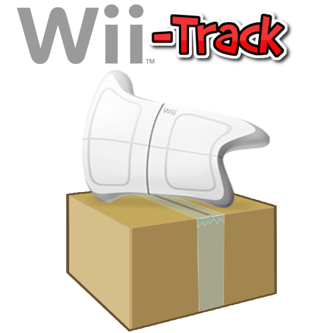

Wii-Track
#########

Distributed inventory tracking using WiiFit, Rasberry Pi, and Arduino. Backed by
the computing power of AWS Lambda, and the flexibility of the DynamoDB NoSQL
database.

Inspiration
===========

Currently, inventory tracking is only done at centralized locations. This leaves
many remote areas with limited inventory tracking capabilities. Our project is
designed to solve this problem by enabling distributed inventory tracking.

What it does
============

Wii-Track uses weight and color sensors to identify objects.

The status of the entire system can be monitored from a simple user interface.
Supervisors can view pictures of packages and remotely resolve any issues that
may arise.

How we built it
===============

The power of our design is that all of the computationally intense data
analytics and image processing take place on AWS Lambda. This allows the remote
inventory tracking nodes to be very lightweight. We used a Raspberry Pi,
Arduino, and WiiFit for this implementation, but we could also use a low cost
embedded device and produce the same effect.

We use AWS DynamoDB to track the inventory. The desktop user interface allows
users to query this database.

Challenges we ran into
======================

We are extremely inexperienced with AWS. As such, it proved difficult to
navigate the AWS portal.

Accomplishments that we're proud of
===================================

- We were able to successfully utilize AWS Lambda and AWS DynamoDB. We had never
  used these technologies before, so it was a huge learning experience for us.
- We were able to successfully connect a Raspberry Pi, Raspberry Pi camera and
  Arduino to create remote image recognition station.
- We were able to utilize the WiiFit board to collect weight data on inventory
  items.

What we learned
===============

We learned how to use many exciting technologies including AWS Lambda, AWS
DynamoDB, and the WiiFit API.

What's next for Wii-Track
=========================

Wii-Track is designed to be highly extensible. Additional edge nodes can be
added easily, and more complex analytics can be integrated into the AWS Lambda
function. Additionally, Wii-Track can utilize different hardware for measuring
characteristics of the inventory. For example, we could use infrared sensors in
addition to the camera and scale that we utilize today. We can also enhance the
supervisor portal for viewing packages remotely.

Hackers
=======

- `Sumner Evans`_
- `David Florness`_
- `Jack Garner`_
- `Robby Zampino`_

.. _Sumner Evans: https://github.com/sumnerevans
.. _David Florness: https://github.com/edwargix
.. _Jack Garner: https://github.com/jhgarner
.. _Robby Zampino: https://github.com/robozman
