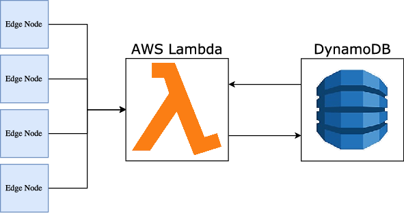

Wii-Track
#########

Overview
========

.. image:: ../logo.png
   :height: 1in

Wii-Track is a system for package tracking designed for use in a variety of
markets such as consumer and business inventory tracking, and agricultural
product management.

Our overall goal is to make inventory tracking more cost-effective by utilizing
sensors and data analytics to identify inventory items automatically.

Architecture
============

System Architecture
-------------------

Technical Constraints
---------------------

**Harsh Outdoor Environments**

  The Wii-Track system can be sealed in a standalone, waterproof package.

**Low Bandwidth**

  Wii-Track nodes only create a connection when there is data to send.
  Additionally, all computation is done on AWS Lambda so we just need to send
  raw data.

**Mobility**

  Wii-Track can be adapted to mount to anything.

**Battery**

  Because Wii-Track nodes do not perform heavy computation, it is very low
  powered. Additionally, nodes can be connected to solar power.

Business Proposition
====================

Market
------

Wii-Track is a highly extensible platform which can be applied to multiple
industries. Some examples include

- Free range livestock movement tracking
- Package and inventory tracking
- Produce tracking

Scale
-----

- Wii-Track is designed to use AWS Lambda in an AWS Autoscaling group.
- The AWS Lambda pricing model only charges per API call, which provides
  predictable pricing.
- Amazon manages all of the infrastructure necessary for AWS Lambda which allows
  businesses to focus developer time on writing code rather than maintaining
  infrastructure.
- Since all data processing is done on AWS Lambda, the system is highly
  extensible.

Business Model
--------------

- Wii-Track provides **Tracking as a Service (TaaS)**.
- Customers can configure the system to meet their needs.
- Monthly subscription to enable data analytics. Pay per data point per sensor
  per month.
- Customers can pay monthly for technical support for their sensor network.

.. but really, the real money maker is the fact that it's a botnet for sale
   (BaaS)
